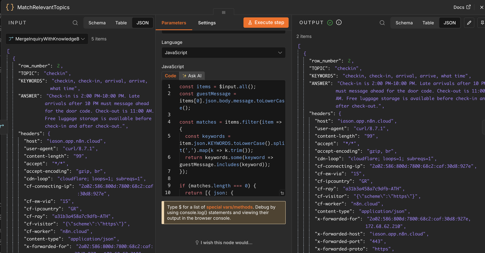

# AI-Powered Guest Inquiry Triage System
### An automation case study — n8n + Claude (Anthropic API)

---

## The Problem

Hospitality businesses — hostels, small hotels, rental operators — receive guest inquiries around the clock through booking platforms, WhatsApp, email, and web forms. These messages fall into very different categories that require very different handling:

- **Routine, answerable questions** ("What time is check-in?", "How do I get there from the port?") — these could be answered instantly, 24/7, without staff involvement.
- **Genuine issues** ("The AC didn't work") — these need a human's attention quickly, and should never get lost in a generic inbox.
- **Ambiguous or out-of-scope requests** (a partnership proposal, an unusual ask) — these need judgment, not automation.

Handled manually, all three get the same treatment: they sit in an inbox until someone has time to triage them. That means slow answers to simple questions and — more importantly — no guarantee that a real complaint gets seen quickly.

This project builds an automated triage layer that classifies incoming guest messages, retrieves only the specific business information relevant to each question, drafts a grounded reply from that retrieved context, and routes anything else to a human — while guaranteeing that no message is ever silently dropped, even if a component fails.

---

## Architecture

```
GuestInquiryReceived (webhook)
        │
        ▼
ClassifyInquiry (Claude) ──► SetCategory
category = booking_logistics | general_question | complaint | special_request
        │ (on failure) ──► SetFallbackCategory
        ▼
MergeMessageAndClassification
        │
        ▼
RouteByCategory
        │
   ┌────┼────────────┬──────────────┐
   ▼    ▼             ▼              ▼
booking_ general_    complaint      special_request
logistics question                  (+ unclassified errors)
   │    │             │              │
   ▼    ▼             │              │
FetchKnowledgeBase     │              │
   │    │             │              │
   ▼    ▼             │              │
MergeInquiryWithKnowledgeBase        │
        │                            │
        ▼                            │
MatchRelevantTopics                  │
(keyword match against              │
 guest message)                     │
        │                            │
        ▼                            │
CheckIfKnowledgeFound                │
   │            │                    │
   ▼ (false)    ▼ (true)             │
CombineMatchedAnswers  │             │
   │            │                    │
   ▼            ▼                    ▼
DraftGuestReply    LogToComplaintRegister
(grounded ONLY in
the specific matched
topics, not the full
reference set)
```

**Key design decisions:**

- **Classification and reply generation are separate steps.** The system first decides *what kind* of message this is, then only drafts a reply for categories where an automated answer is appropriate. Complaints and ambiguous requests always go to a human — the AI never attempts to handle them.
- **Retrieval, not a single hardcoded blob.** Reference information lives as separate rows in a structured knowledge base (topic / keywords / answer), not one large block of text pasted into every prompt. Each guest message is matched against this knowledge base by keyword, and only the relevant row(s) are passed to the reply-drafting step — smaller, cheaper, and more precise than handing the model everything every time.
- **The "don't know" behavior is enforced architecturally, not just by prompt wording.** If keyword matching finds zero relevant topics, the workflow never calls the AI to draft a reply at all — it routes straight to human review. This is a stronger guarantee than instructing the model to say "I don't know," because it removes the opportunity to hallucinate rather than hoping the instruction is followed.
- **Replies are grounded in retrieved reference material, not the model's general knowledge.** The AI is explicitly instructed to answer only from the retrieved information supplied to it. This was tested directly (see below) rather than assumed to work from the prompt wording alone.
- **Failure doesn't mean data loss.** If the classification call fails for any reason (API outage, rate limit, etc.), the workflow doesn't just stop — the message is still captured, tagged as unclassified, and routed to the human-review path. Nothing disappears silently.

---

## What It Demonstrates


- **Grounded AI responses, not hallucination.** Tested with a question that required combining two separate retrieved facts (a guest arriving after normal check-in hours needed both the check-in cutoff and the late-arrival airport transport info) — the system correctly retrieved both relevant topics and synthesized one coherent, accurate reply from just those two, not the entire knowledge base.
- **Precise retrieval, not just correct answers.** Tested with a single-topic question (directions from the port) — the system retrieved only the one relevant topic and left out unrelated information (check-in times, amenities, policies) entirely, confirming the matching step is actually narrowing context, not just passing everything through.


- **Honest uncertainty, enforced structurally.** Tested with a question genuinely outside the knowledge base (parking/bike storage). Zero topics matched, so the AI reply-drafting step was never even called — the message was routed directly to human review. This is a stronger guarantee than a prompt instruction to "say you don't know," since the model is never given the chance to answer at all.
- **Resilience to failure.** The classification step was deliberately broken (invalid model reference) to confirm the fallback path. The guest's message was still captured and routed to human review rather than lost — proven with a live test, not just designed in theory.
- **Correct handling of ambiguous input.** A message that didn't cleanly fit any predefined category (a promotional partnership request) was still routed sensibly to human review rather than forced into the wrong bucket.

---


## Real Issues Encountered and Fixed

Building this surfaced several non-obvious problems — each one a genuine debugging exercise, not a scripted tutorial step:

1. **A trailing period in the webhook path** caused a "webhook not registered" error even though the workflow was correctly armed. The path field contained `hostel-inquiry.` instead of `hostel-inquiry` — a one-character difference that broke the exact-match lookup.
2. **Google Sheets OAuth scope.** The initial credential authorization granted a narrower access scope than the integration needed, causing the connected spreadsheet to be invisible to the node (a 404 on a resource that clearly existed). Fixed by fully disconnecting and re-authorizing with explicit full Drive access.
3. **Data loss across the workflow chain.** Each node in n8n only receives what its *immediate* predecessor outputs — data doesn't automatically travel through the whole chain. `ClassifyInquiry`'s output only contained the AI's response, silently dropping the original guest name, room number, and message. Fixed by adding `MergeMessageAndClassification`, which explicitly rejoins the original webhook data with the classification result.
4. **Merge node input mismatch.** A first attempt at `MergeMessageAndClassification` had both the success path (`SetCategory`) and the error-fallback path (`SetFallbackCategory`) feeding into the same input slot, instead of one path per input — producing an inconsistent, hard-to-diagnose state that only became obvious when checking the two inputs independently rather than trusting the combined output view.
5. **Missing fallback branch.** When `ClassifyInquiry` failed and produced a category value that didn't match any predefined branch, `RouteByCategory` had nowhere to send it — and produced no output at all. Fixed by adding an explicit default/fallback branch, so anything unexpected is routed to `LogToComplaintRegister` for human review rather than vanishing.
6. **A duplicate connection silently corrupted one category's data, but not the other's.** After adding the knowledge-retrieval pipeline, `general_question` had two separate connections feeding the same merge input — one correctly through `FetchKnowledgeBase`, and one left over from before retrieval was added, going directly to the merge step. This meant the merge input received a mix of real knowledge-base rows and a stray plain-message item with no `KEYWORDS` field, causing `MatchRelevantTopics` to crash intermittently depending on which item happened to be read first. `booking_logistics` worked fine throughout, because it never had the duplicate connection — which made this bug easy to misdiagnose as a timing issue rather than what it actually was: a wiring mistake visible only by tracing every connection into the affected node.
7. **A leftover connection routed one entire category around the safety logic.** `special_request` was still wired directly to the reply-drafting step from an earlier version of the workflow, meaning ambiguous requests could bypass human review and get an AI-drafted answer instead of the intended escalation. Caught by testing an edge-case message and noticing it took an unexpected path, then confirmed by explicitly tracing `RouteByCategory`'s connections node by node rather than assuming the wiring matched the intended design.
8. **Per-item processing produced duplicate replies instead of one combined answer.** When a message matched more than one knowledge-base topic, the reply-drafting step initially ran once per matched item, producing multiple separate replies instead of one reply synthesizing all matched information. Fixed by adding a dedicated aggregation step that combines all matched topics into a single block of context before the AI ever drafts a reply.

---

## Honest Limitations

- **Retrieval is keyword-based, not semantic.** Matching works by checking whether literal keywords appear in the guest's message, which is fast and transparent but won't catch a rephrasing that doesn't share any of the listed keywords (e.g., a synonym or a typo). A production version would likely add embedding-based (semantic) retrieval as a fallback for messages that don't match on keywords alone.
- **The knowledge base here is small and fictional**, built to prove the concept. A real deployment would need a comprehensive, regularly updated set of topics covering the business's actual policies.
- **Replies are drafted, not auto-sent.** This is a deliberate choice for a first version — a human should review AI-drafted guest communications before they go out, at least until the system has a track record.
- **Single language.** A real deployment for a Greek hospitality business would need to handle inquiries in Greek and other common guest languages, not just English.
- **Classification categories are fixed and small.** Real guest inquiries will include more variety than four categories can cleanly capture; the fallback-to-human path is what makes this safe in practice, but a production version would likely refine the category set based on real message volume.

---

## Stack

n8n (workflow orchestration) · Anthropic Claude API (classification + reply generation) · Google Sheets (human-review logging)

---

A related project, an AI-powered lead scoring and routing system that classifies and scores inbound leads by urgency, logs every lead to CRM, and routes by priority, is available here: https://github.com/iason-a/ai-lead-scoring-system/tree/main
