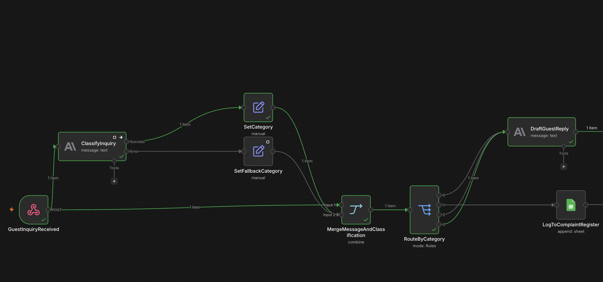
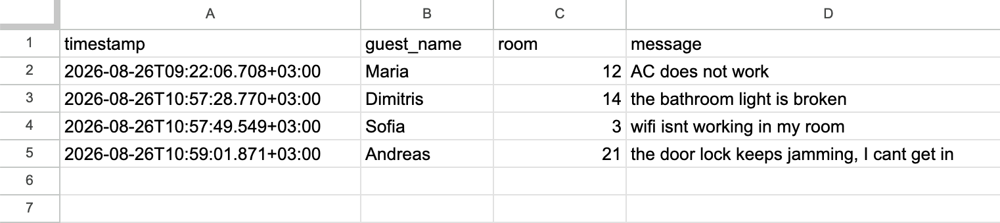

# AI-Powered Guest Inquiry Triage System
### An automation case study — n8n + Claude (Anthropic API)

---

## The Problem

Hospitality businesses — hostels, small hotels, rental operators — receive guest inquiries around the clock through booking platforms, WhatsApp, email, and web forms. These messages fall into very different categories that require very different handling:

- **Routine, answerable questions** ("What time is check-in?", "How do I get there from the port?") — these could be answered instantly, 24/7, without staff involvement.
- **Genuine issues** ("The AC didn't work") — these need a human's attention quickly, and should never get lost in a generic inbox.
- **Ambiguous or out-of-scope requests** (a partnership proposal, an unusual ask) — these need judgment, not automation.

Handled manually, all three get the same treatment: they sit in an inbox until someone has time to triage them. That means slow answers to simple questions and — more importantly — no guarantee that a real complaint gets seen quickly.

This project builds an automated triage layer that classifies incoming guest messages, answers routine questions directly using the business's own reference information, and routes anything else to a human — while guaranteeing that no message is ever silently dropped, even if a component fails.

---

## Architecture


```
Guest message (webhook)
        │
        ▼
AI Classification (Claude)
category = booking_logistics | general_question | complaint | special_request
        │
        ▼
   Merge (rejoin original message data + classification)
        │
        ▼
      Switch (route by category)
        │
   ┌────┼────────────┬──────────────┐
   ▼    ▼             ▼              ▼
booking_ general_    complaint      special_request
logistics question                  (+ unclassified errors)
   │    │             │              │
   ▼    ▼             ▼              ▼
AI-drafted reply    Logged to Google Sheets for human review
(grounded in the
business's own
reference info)
```

**Key design decisions:**

- **Classification and reply generation are separate steps.** The system first decides *what kind* of message this is, then only drafts a reply for categories where an automated answer is appropriate. Complaints and ambiguous requests always go to a human — the AI never attempts to handle them.
- **Replies are grounded in a fixed reference document, not the model's general knowledge.** The AI is explicitly instructed to answer only from the supplied business information, and to say "I'll have staff follow up" rather than guess when something isn't covered. This was tested directly (see below) rather than assumed to work from the prompt wording alone.
- **Failure doesn't mean data loss.** If the classification call fails for any reason (API outage, rate limit, etc.), the workflow doesn't just stop — the message is still captured, tagged as unclassified, and routed to the human-review path. Nothing disappears silently.

---

## What It Demonstrates



- **Grounded AI responses, not hallucination.** Tested with a question that required combining two separate facts from the reference material (a guest arriving after normal check-in hours) — the system correctly connected both facts into one coherent, accurate answer, rather than just pattern-matching a single line.
- **Honest uncertainty.** Tested with a question genuinely outside the reference material (parking/bike storage). The system correctly declined to guess and routed the guest to a human, instead of inventing a plausible-sounding but false policy — arguably the single most important property for anything guest-facing.
- **Resilience to failure.** The classification step was deliberately broken (invalid model reference) to confirm the fallback path. The guest's message was still captured and routed to human review rather than lost — proven with a live test, not just designed in theory.
- **Correct handling of ambiguous input.** A message that didn't cleanly fit any predefined category (a promotional partnership request) was still routed sensibly to human review rather than forced into the wrong bucket.

---



## Real Issues Encountered and Fixed

Building this surfaced several non-obvious problems — each one a genuine debugging exercise, not a scripted tutorial step:

1. **A trailing period in the webhook path** caused a "webhook not registered" error even though the workflow was correctly armed. The path field contained `hostel-inquiry.` instead of `hostel-inquiry` — a one-character difference that broke the exact-match lookup.
2. **Google Sheets OAuth scope.** The initial credential authorization granted a narrower access scope than the integration needed, causing the connected spreadsheet to be invisible to the node (a 404 on a resource that clearly existed). Fixed by fully disconnecting and re-authorizing with explicit full Drive access.
3. **Data loss across the workflow chain.** Each node in n8n only receives what its *immediate* predecessor outputs — data doesn't automatically travel through the whole chain. The classification step's output only contained the AI's response, silently dropping the original guest name, room number, and message. Fixed with a Merge node that explicitly rejoins the original webhook data with the classification result.
4. **Merge node input mismatch.** A first attempt at the Merge node had both the success path and the error-fallback path feeding into the same input slot, instead of one path per input — producing an inconsistent, hard-to-diagnose state that only became obvious when checking the two inputs independently rather than trusting the combined output view.
5. **Missing Switch fallback.** When the classification step failed and produced a category value that didn't match any predefined branch, the Switch node had nowhere to send it — and produced no output at all. Fixed by adding an explicit default/fallback branch, so anything unexpected is routed to human review rather than vanishing.

---

## Honest Limitations

- **The reference knowledge base here is small and fictional**, built to prove the concept. A real deployment would need a comprehensive, regularly updated reference document covering the business's actual policies.
- **Replies are drafted, not auto-sent.** This is a deliberate choice for a first version — a human should review AI-drafted guest communications before they go out, at least until the system has a track record.
- **Single language.** A real deployment for a Greek hospitality business would need to handle inquiries in Greek and other common guest languages, not just English.
- **Classification categories are fixed and small.** Real guest inquiries will include more variety than four categories can cleanly capture; the fallback-to-human path is what makes this safe in practice, but a production version would likely refine the category set based on real message volume.

---

## Stack

n8n (workflow orchestration) · Anthropic Claude API (classification + reply generation) · Google Sheets (human-review logging)
